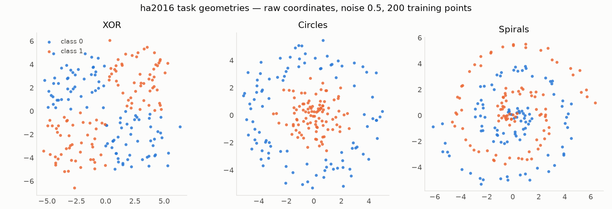
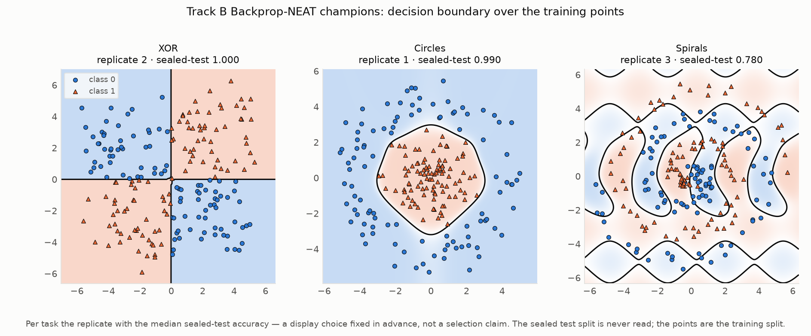
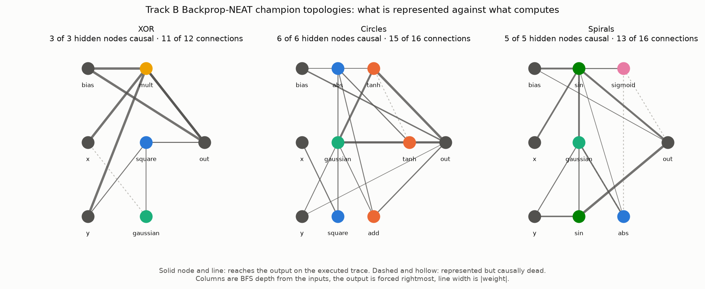
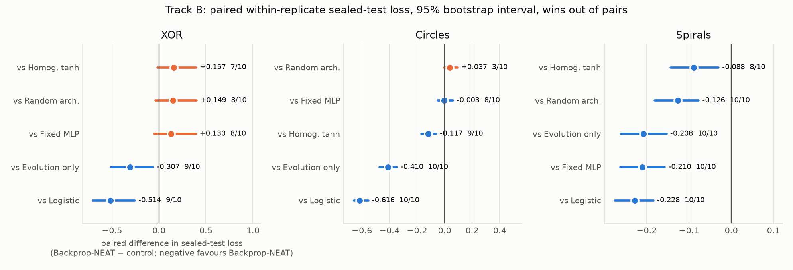
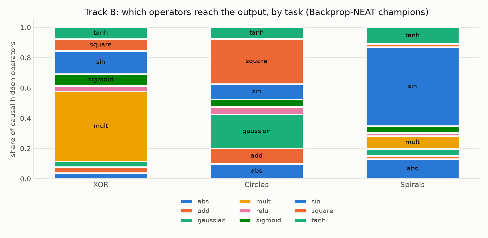

# Neural architecture search with backprop

**Can a search process be trusted to design something no one can check by hand?**
Second of three experiments toward computational foreign policy. Here the thing
being designed is a small neural network that evolves its own structure, on
problems where the right answer is hidden from any single straight line.

[](https://github.com/ReloadLightly/backprop-neat-summer/actions/workflows/ci.yml)
[](LICENSE)

> *"…build a multilayer network among its ally and like-minded countries, expand it, and strengthen deterrence."*
> — National Security Strategy of Japan, December 2022

That sentence assumes a mechanism: that a network can be grown node by node and
strengthened edge by edge until the ensemble sees what no single connection can.
This repository studies that mechanism in the smallest laboratory that has it —
computation graphs whose topology is evolved and whose parameters are trained,
classifying geometries that defeat any single decision line. **It supports no
geopolitical claim** (the claim ladder below is explicit about this). It is the
calibration bench for an instrument that the final experiment in this line
points at an open world. The argument is made in full in
[`docs/writeup.md`](docs/writeup.md).

## What this is

A NumPy reconstruction of David Ha's
[Backprop-NEAT](https://blog.otoro.net/2016/05/07/backprop-neat/) (2016),
audited against the published source
([`hardmaru/backprop-neat-js`](https://github.com/hardmaru/backprop-neat-js))
rather than rebuilt from memory, and run as a frozen, preregistered experiment:
six conditions that each remove one mechanism, ten paired replicates per task,
two propagation tracks that are never pooled, and a sealed test evaluated
exactly once.

| Track | Propagation | Fitness | Purpose |
|---|---|---|---|
| A | `ha2016` — Ha's exact break rule | training loss | historical reconstruction |
| B | `settled` — topology-determined fixed point | validation loss | mechanism comparison |

This is **Experiment 2 of 3** in a research line on evolutionary search for
open-world decision problems: competitive coevolution
([`competitive-coevolution-of-slimes`](https://github.com/ReloadLightly/competitive-coevolution-of-slimes))
→ topology-and-parameter search under a frozen protocol (this repository) →
LLM-driven program evolution over foreign-policy portfolios
(*actir-shinkaevolve*, forthcoming). The master write-up is *After 2022:
Japan's Search for a Novel Foreign Policy*; this repository is its Chapter-4
evidence.

## Status

Protocol **v2 is released**: 360 runs, zero failures, sealed test evaluated
once — [`results/backprop-neat-v2/`](results/backprop-neat-v2/), with the full
claim ladder in the [release README](results/backprop-neat-v2/README.md).
Protocol **v1 is invalidated** for a selection-fidelity defect and retained for
audit ([`docs/v1-invalidation.md`](docs/v1-invalidation.md)); no v1 number may
be cited.

## Headline: sealed-test accuracy, track B

Mean over ten paired replicates.

| Task | Backprop-NEAT | Homog. tanh | Evolution only | Random arch. | Fixed MLP | Logistic |
|---|---|---|---|---|---|---|
| XOR | **0.996** | 0.995 | 0.736 | 0.986 | 0.979 | 0.536 |
| Circles | **0.986** | 0.943 | 0.791 | 0.988 | 0.973 | 0.503 |
| Spirals | **0.787** | 0.746 | 0.639 | 0.713 | 0.637 | 0.596 |

The spirals column is the finding. On XOR and circles, a fixed MLP or random
architecture search matches or beats Backprop-NEAT: easy geometry does not pay
for search. On the one deceptive geometry, Backprop-NEAT beat every control on
sealed-test loss — paired within replicate, 95% bootstrap intervals:

| Spirals, vs | Mean diff | 95% CI | Wins |
|---|---|---|---|
| Fixed MLP | **−0.210** | [−0.262, −0.157] | 10/10 |
| Evolution only | **−0.208** | [−0.262, −0.153] | 10/10 |
| Random arch. | **−0.126** | [−0.181, −0.077] | 10/10 |
| Logistic | **−0.228** | [−0.275, −0.184] | 10/10 |
| Homog. tanh | **−0.088** | [−0.144, −0.030] | 8/10 |

And it did so with almost no structure: 2.6 (XOR), 4.0 (circles), 4.6
(spirals) causally active hidden nodes, against the fixed MLP's 65.
Validation-based selection did not overfit — mean validation→test drop is
≤0.032 in every condition and ≤0.011 for Backprop-NEAT.

Total compute: 268,800 candidate evaluations, 11,653,669 realized gradient
steps, **1.87 core-hours**.

## What is supported, and what is not

**Supported.** (1) On the deceptive geometry, Backprop-NEAT beat the fixed MLP,
random architecture search, evolution-only and the linear floor in 10/10 paired
replicates, with intervals excluding zero. (2) Gradient learning and topology
search are complementary: evolution alone lost on all three tasks, decisively
(XOR 9/10, circles 10/10, spirals 10/10). (3) Evolved architectures specialise
by task in *which operators reach the output* — XOR runs on `mult` (0.46),
circles on `square`+`gaussian` (0.53), spirals on `sin` (0.52) — not merely in
size.
(4) Represented size is not computation: 4.6 causally active hidden nodes beat
a 65-unit MLP on spirals. (5) Ha's exact propagation rule measurably changes
what evolution discovers, and its cost is task-dependent (XOR sealed-test
accuracy 0.751 under `ha2016` against 0.996 settled).

**Not supported.** That architecture search beats fixed architectures in
general (two of three tasks say otherwise); that evolutionary selection beats
random sampling in general (spirals only; random search won circles); that this
reproduces Ha's Figure 10.3 champions (accuracy regime: reached; champion
sizes: not reproduced on any task — see
[`docs/reference-targets.md`](docs/reference-targets.md)); and anything about
geopolitics, forecasting, or foreign policy — these are two-dimensional
synthetic classification tasks.

The most tempting unsupported claim, stated so it can be resisted: *"evolution
discovers better architectures than human engineers."* The defensible version
is narrower and more interesting: architecture search paid off exactly where
the problem was deceptive, and paid off in structure-efficiency rather than raw
accuracy.

## Figures











Every figure and every table is derived from `raw/runs/*.json` in the release —
nothing is recomputed, no model is retrained. The champion drawings use, per
task, the replicate with the median sealed-test accuracy: a display choice, not
a selection claim.

## What the gates caught

Three findings about the *reference algorithm* surfaced before any
confirmatory compute was spent, and shaped the protocol:

**A naive baseline is silently zeroed by Ha's propagation rule.** The rule
stops propagation once every node has been touched, and the output node is
recomputed before every hidden node. Wire bias directly into both the output
and the hidden units — the obvious way to build an MLP — and the network
returns a constant: a 32×32 MLP built that way scores 0.500, a dead control.
Every baseline here routes its output bias through a carrier node and is
verified alive under both propagation modes. A comparison against a control
crippled this way would be void.

**Settling must be bounded and weight-independent.** Recurrent cycles carrying
`square`/`mult` diverge within ticks, so node values are clamped and the tick
count derives from topology by BFS — a value-dependent stopping rule would make
the traced function discontinuous. Finite-difference gradient error fell
4.5e14 → 6.6e-2 → 3.7e-7 as each cause was removed.

**Selection fidelity decides whether topologies grow at all.** The reference
selects parents by fitness-proportionate roulette over the whole subpopulation,
with no elite — an error-0.3 genome breeds only ~2.3× as often as an error-0.7
one. That weakness is functional: it lets neutral structure survive long enough
to combine. An earlier version of this code used elitism plus truncation, which
pinned topologies at the minimal seed and produced a false finding. Protocol v1
was invalidated for it rather than patched
([`docs/v1-invalidation.md`](docs/v1-invalidation.md)).

## Verify and reproduce

```bash
git clone https://github.com/ReloadLightly/backprop-neat-summer
cd backprop-neat-summer
python -m venv .venv && . .venv/bin/activate
pip install -e ".[dev]"

pytest -q                                               # correctness gates
bpneat verify --dir results/backprop-neat-v2/track-a    # the release regenerates
bpneat verify --dir results/backprop-neat-v2/track-b    #   byte-identically
```

`bpneat verify` rebuilds every derived table from the raw run records in a
temporary directory and byte-compares it against the committed release, checks
every file hash in `sha256sums.txt`, and confirms the code fingerprint still
matches the one the suite ran under. The release is not something to take on
trust; it is something this command proves on your machine.

To regenerate tables and figures, or re-run the study:

```bash
bpneat report   --dir results/backprop-neat-v2/track-b
bpneat figures  --dir results/backprop-neat-v2
bpneat champions --dir results/backprop-neat-v2          # boundary + topology drawings

bpneat plan --track B                                    # 180 runs
bpneat suite --track B --out results/rerun/track-b       # shardable, resumable
bpneat final-test --dir results/rerun/track-b            # refuses drafts and modified code
```

Measured budget for the full 360-run matrix: 1.87 core-hours (32 minutes
across four shards). Shards never overwrite each other, completed runs
are skipped by code fingerprint, and `manifest.json` is refreshed after every
run so progress is read rather than guessed. `bpneat final-test` runs exactly
once per release: it refuses an incomplete, draft, already-evaluated or
code-modified suite.

## Repository map

| Path | What it is |
|---|---|
| `src/bpneat/` | the reconstruction and the experiment machinery; seven science modules are fingerprint-frozen to the release |
| `tests/` | the gates — dataset independence, gradient checks, propagation semantics, sealed-test isolation, resume-exactness, the final-test firewall |
| `bench/` | feasibility probes that sized the compute budget from measurement |
| `docs/` | the frozen protocol, the v1 invalidation, reference targets, and the write-up |
| `results/backprop-neat-v2/` | the citable release: raw records, tables, figures, `final-test.json`, checksums |
| `results/backprop-neat-v1/` | invalidated, retained so the invalidation can be audited |
| `run_shard.sh` | how the v2 suite was actually executed |

## Lineage

- David Ha, ["Neural Network Evolution Playground with Backprop
  NEAT"](https://blog.otoro.net/2016/05/07/backprop-neat/) (2016), and
  [`hardmaru/backprop-neat-js`](https://github.com/hardmaru/backprop-neat-js) —
  the reference this implementation was audited against.
- Risi, Tang, Ha & Miikkulainen, [*Neuroevolution: Harnessing Creativity in AI
  Agent Design*](https://neuroevolutionbook.com/), §10.1 "Neural Architecture
  Search with NEAT", Figures 10.1 and 10.3.
- Stanley & Miikkulainen, "Evolving Neural Networks through Augmenting
  Topologies", *Evolutionary Computation* 10(2), 2002 — NEAT itself.

On fidelity: this reconstruction reaches the reference accuracy regime but does
not reproduce the published champion sizes on any task; the discrepancy is
understood and documented in
[`docs/reference-targets.md`](docs/reference-targets.md), and no claim of
reproducing Figure 10.3 is made.

## License and citation

Apache-2.0 (see [`LICENSE`](LICENSE)). To cite this repository, use
[`CITATION.cff`](CITATION.cff) and cite the **v2 release** — v1 numbers are
invalidated and exist only for audit.
