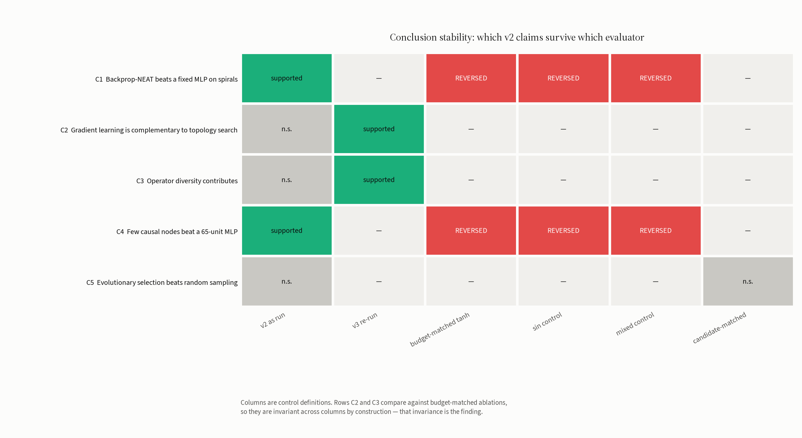
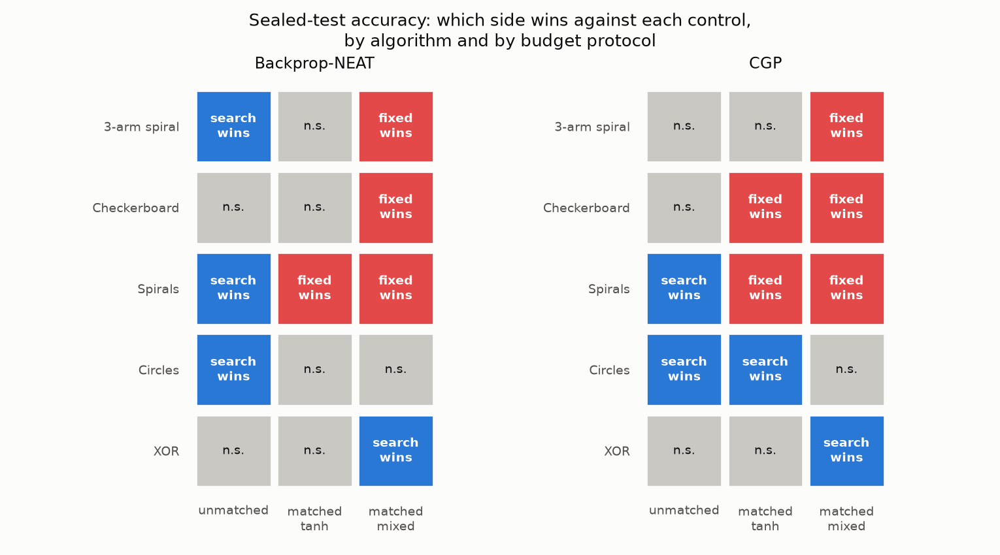
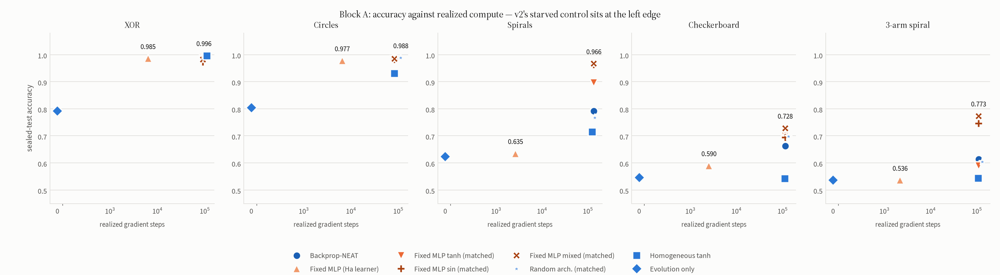
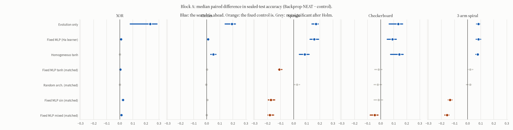
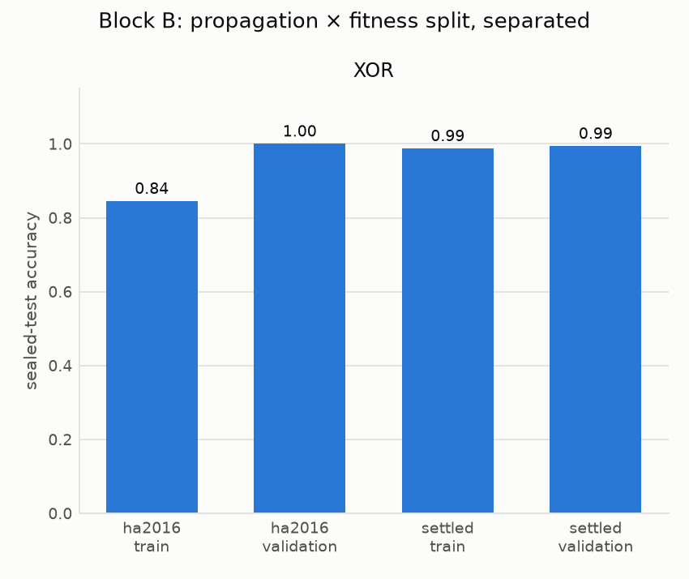
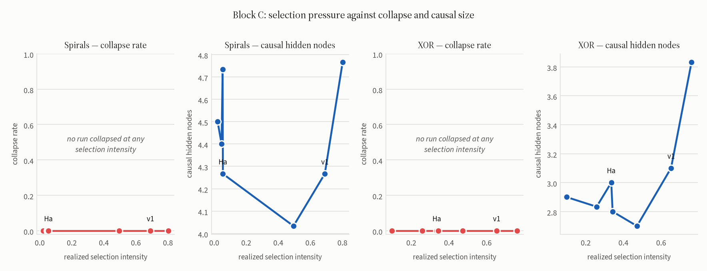

# When the evaluator decides

**A reconstruction of David Ha's Backprop-NEAT, run four times, that changed its
own conclusions three times — each time because of an implementation detail the
algorithm's published description does not fix. The third correction is to the
protocol that made the first two.**

[](https://github.com/ReloadLightly/neural-architecture-search-with-backprop/actions/workflows/ci.yml)
[](LICENSE)

## Abstract

[Backprop-NEAT](https://blog.otoro.net/2016/05/07/backprop-neat/) (Ha, 2016)
evolves network topology while backpropagation trains every evaluated
candidate. We reconstruct it in NumPy, audited against the published source,
frozen behind a module fingerprint, with every published number regenerating
byte-identically from committed raw records.

Its conclusions still changed twice.

In protocol **v1**, a selection operator we chose ourselves produced the
finding that Ha's propagation rule traps evolution at the linear floor. In
protocol **v2**, with the reference operator restored, that vanished — but v2's
headline rested on a control the *learner's stopping rule* halted after 42
gradient steps against the evolutionary condition's 132,138.

Protocol **v3** therefore treats the implementation details as the experiment:
1,920 preregistered runs, 30 paired replicates, five geometries, four factors.
**The same 32×32 network scores 0.635 on spirals under v2's evaluator and 0.896
under a matched budget.** A fixed network with a sinusoidal activation reaches
0.962 against Backprop-NEAT's 0.791, losing none of 30 paired replicates.

Two of v2's five claims reverse under every fairly trained control. Three of
our five preregistered hypotheses failed. All of it is reported.

Protocol **v4** then turns the same instrument on v3, by running a second,
independently derived topology search — Cartesian Genetic Programming with
gradient-trained candidates, sharing no encoding, no selection mechanism and no
code with the first — through the same controls, across 1,200 further runs on
test splits no earlier release had opened. **Four of its six preregistered
hypotheses failed, including the one we most expected to hold.**

The artifact is universal; the reversal is not. Restoring the budget the control
was denied raises it on all five geometries, for both algorithms. But *search
losing to a fairly trained control* proves geometry-dependent rather than
general, so v3's headline is a true statement about the deceptive geometry and
not a law about architecture search. What does replicate across both algorithms
is that the search component never beats its own candidate-matched null — and on
the two hardest geometries CGP is significantly beaten by one.

> **Start here:** the conclusion stability matrix
> ([`results/backprop-neat-v3/`](results/backprop-neat-v3/)) · what a second
> algorithm did to it ([`results/backprop-neat-v4/`](results/backprop-neat-v4/))
> · the errata ([`docs/v2-errata.md`](docs/v2-errata.md)) · the paper
> ([`docs/paper/main.md`](docs/paper/main.md))

## 1. Results first: the stability matrix

Which v2 headline claim survives which evaluator. Wilcoxon signed-rank with
Holm correction over each source's pre-declared family.



| | Claim | v2 as run | v3 re-run | matched tanh | sin | mixed | cand.-matched |
|---|---|---|---|---|---|---|---|
| C1 | Beats a fixed MLP on spirals | supported | — | **reversed** | **reversed** | **reversed** | — |
| C2 | Gradient learning complements topology search | n.s. | supported | — | — | — | — |
| C3 | Operator diversity contributes | n.s. | supported | — | — | — | — |
| C4 | Few causal nodes beat a 65-unit MLP | supported | — | **reversed** | **reversed** | **reversed** | — |
| C5 | Selection beats random sampling | n.s. | — | — | — | — | n.s. |

Read the first column: under correction, v2's own data supports only C1 and
C4 — exactly the two that reverse. The two that survive needed v3's 30
replicates to reach significance at all.

## 2. What a second algorithm did to that matrix

v4 asks the obvious objection: is Backprop-NEAT simply weak? It runs Cartesian
Genetic Programming — fixed-length genotype with a genotype-phenotype map, no
innovation numbers, no crossover, (1+4) with neutral drift — through the same
controls, holding the geometries, inner learner, fitness, weight inheritance and
candidate budget identical. 1,200 runs, 150 cells, 30 paired replicates, zero
failures, on dataset seeds no earlier release opened.



Sealed-test accuracy, mean over 30 replicates; search conditions marked \*:

| condition | XOR | circles | spirals | checkerboard | 3-arm spiral |
|---|---|---|---|---|---|
| Backprop-NEAT \* | 0.990 | 0.984 | 0.791 | 0.621 | 0.590 |
| CGP (1+4) \* | 0.989 | 0.986 | 0.741 | 0.584 | 0.558 |
| fixed tanh, **unmatched** | 0.983 | 0.971 | 0.640 | 0.570 | 0.528 |
| fixed tanh @ BP-NEAT budget | 0.986 | 0.979 | 0.898 | 0.686 | 0.583 |
| fixed tanh @ CGP budget | 0.986 | 0.980 | 0.867 | 0.695 | 0.572 |
| fixed **mixed** @ BP-NEAT budget | 0.977 | 0.985 | **0.964** | **0.714** | **0.783** |
| fixed **mixed** @ CGP budget | 0.978 | 0.985 | 0.960 | 0.713 | 0.753 |
| random CGP, candidate-matched | 0.989 | 0.985 | 0.757 | 0.694 | 0.601 |

Three things, in order of how much they cost us to accept.

**The artifact replicates on every geometry (v4-H1, 5/5).** Give the fixed
control the budget it was denied and it improves everywhere — on spirals
0.640 → 0.898, with its success rate going from 0 of 30 replicates to 30 of 30.
§3's diagnosis is confirmed out of sample.

**The reversal does not (v4-H2 and v4-H3 both fail).** Search losing to a fairly
trained control happens on spirals for both algorithms and on checkerboard for
CGP, and nowhere else; XOR and circles saturate above 0.97 and separate nothing.
We required ≥4 and ≥3 geometries in advance and got 1 and 2. This is v4
correcting v3, and it is the reason the headline below is now stated as a
property of the deceptive geometry rather than of architecture search.

**Selection is the component that does not pay (v4-H6, 0/5).** CGP never beats
its candidate-matched null, and the null beats *it* significantly on
checkerboard (median −0.090, Holm *p* = 0.000) and the 3-arm spiral (−0.047,
*p* = 0.011). Selection drives CGP to 0.8 active function nodes on checkerboard
against 7.8 for the unselected control — in an encoding where all 48 nodes are
reachable from the first generation, so this is chosen, not imposed. With v3,
that is two independently derived algorithms whose search component contributes
nothing measurable here.

A fourth result is methodological. Two evaluators that agree on forward values
to 2e-15 and gradients to 3e-15 — the same model, pinned by tests — train 5% of
candidates to visibly different networks, because RMSProp's epsilon floor
amplifies gradient differences a hundredfold per step. **An architecture-search
result reported from single runs is not reproducible in principle.**
([`docs/v4-sensitivity.md`](docs/v4-sensitivity.md))

## 3. The headline: one rule, 0.261 accuracy

Sealed-test accuracy on spirals, 30 paired replicates. The architecture is
identical in rows 2–3; only the stopping rule differs.

| Condition | Spirals | Realized gradient steps |
|---|---|---|
| Fixed MLP mixed, budget-matched | **0.966** | 134,428 |
| Fixed MLP sin, budget-matched | **0.962** | 134,428 |
| Fixed MLP tanh, budget-matched | **0.896** | 134,428 |
| Backprop-NEAT | 0.791 | 134,449 |
| Random architecture, candidate-matched | 0.768 | 140,447 |
| Homogeneous tanh | 0.715 | 124,893 |
| Fixed MLP tanh, *v2's Ha learner* | 0.635 | **2,633** |
| Evolution only | 0.623 | 0 |
| Baldwinian | 0.532 | 159,083 |



Paired differences, Holm-corrected over the pre-declared family of 35:

| Control | Median diff | 95% CI | Wins | Holm *p* |
|---|---|---|---|---|
| Fixed MLP mixed, matched | −0.182 | [−0.197, −0.152] | 0/30 | 6.0e-05 |
| Fixed MLP sin, matched | −0.175 | [−0.195, −0.145] | 0/30 | 6.0e-05 |
| Fixed MLP tanh, matched | −0.110 | [−0.120, −0.090] | 1/30 | 6.3e-05 |
| Random arch., candidate-matched | +0.025 | [+0.003, +0.045] | 20/30 | 0.385 |
| Homogeneous tanh | +0.085 | [+0.043, +0.117] | 23/30 | 0.018 |
| Evolution only | +0.170 | [+0.140, +0.188] | 30/30 | 6.0e-05 |



The operative variable is the **operator prior**, not the search. On the 3-arm
spiral the budget-matched *tanh* network is worse than Backprop-NEAT (0.589 vs
0.614) while *sin* and *mixed* are far better (0.746, 0.773).

## 4. The method, and why it is trustworthy about its own failures

A NumPy reconstruction over nine operators with recurrent edges, minimal
logistic seeds, add-node/add-connection mutation under an innovation registry,
union crossover and K-medoids speciation. Every candidate is trained by
backpropagation through the executed trace. Parameters were read from
`hardmaru/backprop-neat-js`, not recalled.

Around it: a seven-module fingerprint the final-test command refuses to run
without; atomic run records carrying their own config, metrics, compute and
serialized champion; exact resume asserted bit-identical; and a sealed test
readable by exactly one module, with a gate that poisons it with NaN and
asserts search output does not change. 146 gates, and an automated check that
**every number in every document is recomputed from a release file** — which
caught a wrong figure in this very README during drafting.

That machinery is why the failures below are documented rather than invisible.

## 5. Two failures, and a corrected correction

**v1 — a selection operator we chose.** We used elitism plus truncation; the
reference replaces the whole population and samples parents by
fitness-proportionate roulette with weight `1/(-fitness + 0.01)`, under which
an error-0.3 genome breeds only ~2.3× as often as an error-0.7 one. That
weakness is functional: it lets neutral structural additions survive to
combine. v1 was invalidated, not patched
([`docs/v1-invalidation.md`](docs/v1-invalidation.md)).

**v2 — a stopping rule we inherited faithfully.** Ha's rollback check halts a
69-node network after ~42 updates while barely touching an 8-node evolved
graph. Two claims withdrawn, two narrowed
([`docs/v2-errata.md`](docs/v2-errata.md)); audit reproduced in
[`docs/audit-2026-10.md`](docs/audit-2026-10.md).

**And v3 corrected our correction.** We had blamed v1's collapse on its
selection operator. v3 shows collapse is zero at *every* selection level —
including v1's own operator, which scores **above** Ha's setting (0.809 vs
0.791). Collapse is an interaction of propagation and fitness split:

| Propagation | Fitness | XOR | Circles | Spirals |
|---|---|---|---|---|
| `ha2016` | train | 0.811 / **0.17** | 0.940 / 0.03 | 0.720 / **0.20** |
| `ha2016` | validation | 0.951 / 0.00 | 0.959 / 0.00 | 0.726 / 0.03 |
| `settled` | train | 0.993 / 0.00 | 0.984 / 0.00 | 0.796 / 0.00 |
| `settled` | validation | 0.995 / 0.00 | 0.986 / 0.00 | 0.791 / 0.00 |

*(accuracy / collapse rate)* — v2 varied both factors together, which is why it
could not attribute the effect.




## 6. Hypotheses

Frozen at commit `a343c66` before any compute
([`docs/v3-preregistration.md`](docs/v3-preregistration.md)).

| | Prediction | Outcome |
|---|---|---|
| H1 | matched MLP's spirals deficit disappears or reverses | **reverses** |
| H2 | sin MLP matches or beats on spirals | **holds** |
| H3 | collapse depends on propagation, not fitness split | **fails** — interaction |
| H4 | collapse/causal size vary with selection intensity | **fails** — flat |
| H5 | Lamarckian vs Baldwinian, two-sided | **Lamarckian**, all three tasks |

Three of five failed. Had H1 and H2 failed instead, v2's claims would have been
restored; the preregistration was written to make either outcome publishable.

## 7. Limitations

Five 2-D synthetic geometries. The genome encoding fixes two input nodes in a
frozen module, so higher-dimensional real datasets were **skipped rather than
attempted badly**. One algorithm, one reference implementation. Candidate count
and gradient steps cannot both be matched; we match one, report the other, and
plot accuracy against realized compute. Thirty replicates is enough for the
paired tests reported, not for tails. And a sin-MLP beating evolved champions
is not a claim that sin is the answer — it is a demonstration that an operator
prior can account for a result attributed to search.

## 8. Reproduce

```bash
git clone https://github.com/ReloadLightly/neural-architecture-search-with-backprop
cd neural-architecture-search-with-backprop
make setup && make gates && make verify
```

| Target | What it does |
|---|---|
| `make gates` | 146 correctness gates, plus ruff |
| `make verify` | proves the v2 release rebuilds from its raw records |
| `make audit` | reproduces the October 2026 audit |
| `make v3-run` | the v3 suite, sharded and resumable, in the background |
| `make v3-finaltest` / `make v3-release` | one-shot sealed test, then seal |

`verify` rebuilds every derived table from `raw/runs/*.json` in a scratch
directory and byte-compares against the committed release, rechecks every hash,
and confirms the fingerprints. CI runs it on every push.

**Compute.** v2: 360 runs, 1.87 core-hours. v3: 1,920 runs, 2,143,500 candidate
evaluations, 173,623,974 gradient steps, **23.78 core-hours** against a
24-hour forecast.

## 9. Related work

Ha's Backprop-NEAT [[blog](https://blog.otoro.net/2016/05/07/backprop-neat/),
[source](https://github.com/hardmaru/backprop-neat-js)] extends NEAT
[Stanley & Miikkulainen 2002] by training every candidate; *Neuroevolution*
§10.1 [Risi, Tang, Ha & Miikkulainen 2025] gives the champion figures we use as
a fidelity target. **PropNEAT** [Merry, Riddle & Warren 2024, arXiv:2411.03726]
maps NEAT genomes to layers for GPU backprop — the problem our dense evaluator
solves, but for throughput rather than for provable equivalence inside a
comparison.

The closest precedents are in deep RL: Henderson et al. [2018] on variance
across seeds and codebases, and **Engstrom et al.** [ICLR 2020,
arXiv:2005.12729], who attribute most of PPO's advantage over TRPO to
code-level optimizations. **Oved et al.** [IBM, arXiv:2609.19799] show the same
in LLM evolutionary search — the strategy that looks worst at one seed is best
at forty — and recommend reporting the frontier, not a point. **Benito,
Lutzeyer & Doerr** [arXiv:2605.28703] revisit Lamarckian and Baldwinian
evolution and motivate Block D.

A sister study in this line,
[`competitive-coevolution-of-slimes`](https://github.com/ReloadLightly/competitive-coevolution-of-slimes),
reports from its own release that most of the instability it attributed to
coevolution is injected by Ha's *champion-export rule*, which exports an
individual ranking 60 of 128 in its own population. Two reconstructions of two
Ha demos, failing the same way.

## 10. Repository map

| Path | What |
|---|---|
| [`results/backprop-neat-v3/`](results/backprop-neat-v3/) | the v3 release and its claim ladder |
| [`results/backprop-neat-v2/`](results/backprop-neat-v2/) | v2, with [`ERRATA.md`](results/backprop-neat-v2/ERRATA.md) |
| [`results/backprop-neat-v1/`](results/backprop-neat-v1/) | invalidated, retained for audit |
| [`docs/paper/main.md`](docs/paper/main.md) | GECCO-format draft |
| [`docs/v3-preregistration.md`](docs/v3-preregistration.md) | the frozen v3 contract |
| [`docs/v2-errata.md`](docs/v2-errata.md) · [`docs/audit-2026-10.md`](docs/audit-2026-10.md) | what was wrong, and its reproduction |
| [`docs/writeup.md`](docs/writeup.md) | the motivating argument — an argument, not evidence |
| `src/bpneat/` · `src/bpneat/v3/` | frozen v2 science modules · v3 |

## License and citation

Apache-2.0. Cite the v3 release; see [`CITATION.cff`](CITATION.cff). Protocol v1
is invalidated and no v1 number may be cited. v2's between-condition
comparisons against fixed or randomly sampled architectures are withdrawn —
see the errata.
